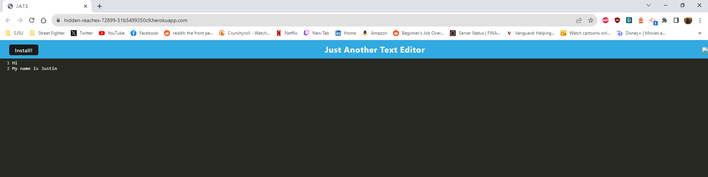
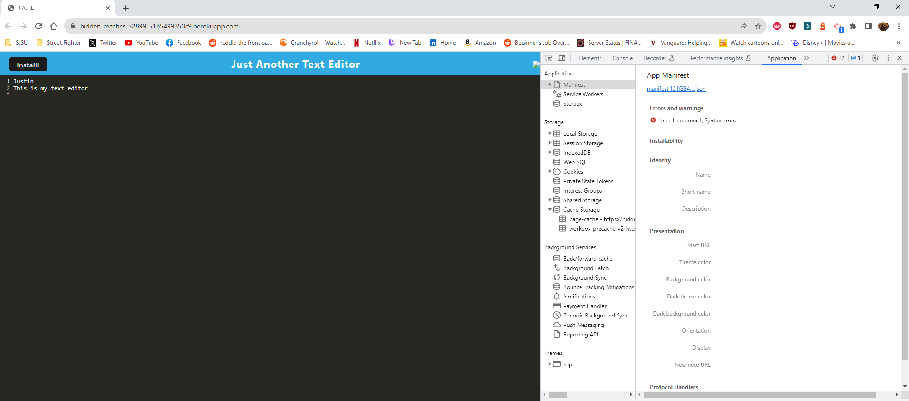
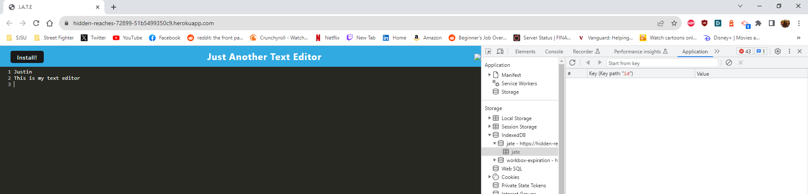

# Challenge 19: PWA Text Editor

## Description
The objective of the project is to build a text editor that runs in the browser. This application will be a single-page application tha meets "Progressive Web Application" or PWA criteria. Also, the application would also function offline.

The text editor will work on the client side of the application. The application is using the idb package, which is a lightweight wrapper ardoun the IndexedDB API. Thsi will be used for storing and retrieving data. 

## Technology Used
- webpack
- HTML plugin
- IDB Package
- Heroku

## Testing

This is what the text editor will look like on the webpage

Here is where the manifest.json is supposed to show

This is supposed to show storage from the IndexedDB

## Updates
- 9/7: Based on graders feedback
    - src-sw.js: changed cache strategy to `{ StaleWhileRevalidate }` and implemented cache with StaleWhileRevalidate
    - webpack.config.js: added the "title" option for the HtmlWebpackPlugin
        - Added publicPath and startUrl options in the "WebpackPwaManifest"
        - Updated the plugin configurations for "babel"
    